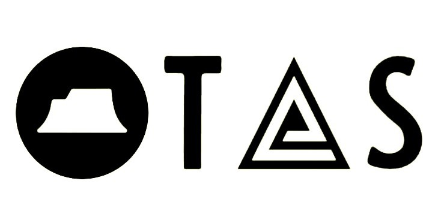

# Tableland Attestation Service (TAS)

Encode Hack project

[author : nijoe1](https://github.com/nijoe1) 

Tableland Attestation Service (TAS) is a decentralized and versatile protocol bridging the gap between digital trust and the Filecoin ecosystem. TAS facilitates the secure verification of data, enabling trust and reliability in various online interactions. With TAS, you can effortlessly create, manage, and verify attestations, paving the way for a more trustworthy digital environment.

## Description
Tableland Attestation Service (TAS) is a robust and extensible protocol designed to bring the power of attestations to the Filecoin ecosystem. At its core, TAS utilizes Tableland, a decentralized SQLite indexing protocol, to enable seamless integration with Filecoin and EVM-compatible blockchains. TAS empowers users to generate and verify attestations, offering cryptographically signed confirmation of the authenticity and accuracy of information.

TAS goes beyond traditional attestation services by offering file attestations for various file types using Lighthouse storage. This means every kind of file can be securely stored on IPFS and replicated on Filecoin, ensuring persistent data storage in the decentralized web. Additionally, TAS provides subscription-based and access control schemas, allowing for tailored access to attestations and versatile data management, including support for private or open AC schemas.

## Problem-Solution
### Problem
In the digital world, establishing trust and credibility can be challenging due to the lack of face-to-face interactions. Authenticating information and ensuring its accuracy is a vital concern, especially with the rise of AI-generated content and deep fakes.

### Solution
Tableland Attestation Service (TAS) addresses these challenges by providing a reliable and secure way to verify and authenticate information. TAS leverages attestations, which are digital signatures on structured data, to offer a cryptographic stamp of approval. These attestations can be made on-chain or off-chain, ensuring the authenticity and immutability of the verified data. By utilizing Tableland and bridging into the Filecoin ecosystem, TAS provides a robust foundation for establishing trust and credibility in the digital realm.

## Technologies Used
TAS leverages several cutting-edge technologies to offer a comprehensive and secure attestation service:
- **Tableland**: A decentralized SQLite indexing protocol supporting Filecoin and EVM-compatible blockchains, providing seamless integration and efficient data management.
- **IPFS and Filecoin**: Utilized for storing attested files securely, ensuring persistent data storage and accessibility.
- **Lighthouse Storage**: Powering file attestations by securely storing files on IPFS and replicating them on Filecoin for longevity and accessibility.
- **Ceramic Network**: Enabling users to store and manage attestations in a secure and decentralized environment.
- **Lighthouse Kavach Network**: Providing encryption capabilities to safeguard sensitive data in attestation services.

## Unlocked Use Cases for the Filecoin Ecosystem
Tableland Attestation Service (TAS) enriches the Filecoin ecosystem by unlocking various use cases, including:
- **File Attestations**: Securely store and attest various file types on IPFS and Filecoin, ensuring the authenticity and integrity of the stored files.
- **Decentralized Identity**: Utilize TAS to create decentralized, self-sovereign identity systems, providing individuals control over their personal data and identity.
- **Supply Chain Provenance**: Verify the authenticity and origin of products by leveraging TAS to trace the supply chain and combat counterfeit goods.
- **Intellectual Property Rights**: Establish ownership claims and verify intellectual property rights for AI-generated content, providing creators with a secure framework for licensing and protection.

TAS unlocks a multitude of possibilities within the Filecoin ecosystem, promoting trust, security, and transparency across diverse applications and industries.

